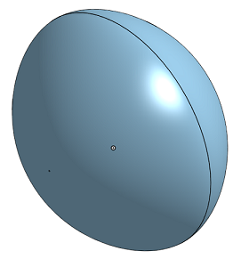
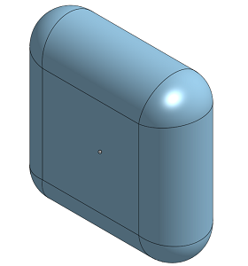

<h1>CaptureWord By Benji Paquette</h1>

<h3>Table of Contents</h3>
<ul>
    <li><a href="#onshape-designs">onShape Designs</a></li>
    <li><a href="code">Code</a></li>
</ul>

 
<h2>onShape Designs</h2>

For my project, I decided to make a clone of the game Catchphrase, creatively naming it "CaptureWord." I started
    out in onshape not knowing exectly how I was goining to make my design, just that it would look like the game,
    made up of two 3d printed shells that would be screwed together. My first designs, however, did not look very
    good. After I disqualified using a revolve, for unknown reasons, I dove into increasingly complex ways to
    produce a less than satisfactory result.

    
    
<em>My first two drafts</em>

 

After spending some time on it, I finally conceded and decided to use a revolve, which worked amazingly, making
    me unsure why I didn't do it in the first place

    
    
<em>3rd time's the charm</em>

 

I then proceeded to add all of the bits I needed to use it in my project

    
    
<em>All finished?...</em>

 

 After that, I was ready to work on assembly and code, or so I thought. However, it turned out, for a myriad
    number of reasons, that I would not be able to 3d print my project, instead having to use the laser cutter.

I opted to switch to a hexagonal prism instead, and was able to get most of it switched over pretty quickly, just
    changing the first sketch and the revolve. There were a few peices, however that defied me, and I struggled on
    them for many weeks before finally giving up or figuring out a solution

The two that defied me the longest were the battery holder and the LCD mount. In my original design, the battery
    holder was a box, reccessed into the shell, with a hole for the wires. Without 3d printing it, there was no way
    to have a reccesed box like that, but I kept on trying to do it for many a day, as it would make it hard to rest
    the game on a surface and still see the top. Eventually however, I gave in and just cut holes for the screws and
    the wiring on the bottom.

The LCD screen, while it took longer, ast least got a resolution. My ellipsoid version had it mounted above a
    rectangular hole by two 3d priunted supports. Obviously, this had to change. I tarried to and fro on this for a
    few weeks, trying to see if I could laser cut the parts and fit them into a notch, or mount it flush to the top
    woth the screen sticking through. Eventually, I realised that I could use the standoffs for the arduino for the
    LCD screen as well.

    
    
<em><strong>Actually</strong> all finished</em>

 

And that was that. One hexagonal prisim Catchphrase clone designed. Time to work on the code...

<h2>Code</h2>

The code is currently unfinished, so I cannot give a full picture of how it will turn out. I can, howevergive some thoughts on how it is going and my goals for it

In the main game the words will work by storing the words in <a href="https://en.wikipedia.org/wiki/EEPROM">EEPROM</a> and displaying them on the screen when needed. The buttons will function using <a href="https://en.wikipedia.org/wiki/Interrupt">interrupts</a> in order to allow the clock to count down.

While the game is not in the timer loop, it will poll for button presses, first waiting for the point-earning team to be selected, at which point it will either declare a winner or continue, and then for the timer to be restarted.

Working with strings has been a bit of a struggle. Unfortunantly arduino does not have the standard c++ or c libraries, so I cannot use strings or vectors, instead having to use a c-style array of chars and pass around pointers. I also was not able to find any information online about the commands you can issue to a LCD screen with an I2C backpack, only information for a library or a full 16-pin setup.

CaptureWordBy Benji Paquette

Table of Contents

    onShape Designs
    Code

onShape Designs

For my project, I decided to make a clone of the game Catchphrase, creatively naming it "CaptureWord." I started
    out in onshape not knowing exactly how I was going to make my design, just that it would look like the game,
    made up of two 3d printed shells that would be screwed together. My first designs, however, did not look very
    good. After I disqualified using a revolve, for unknown reasons, I dove into increasingly complex ways to
    produce a less than satisfactory result.

    
    My first two drafts

After spending some time on it, I finally conceded and decided to use a revolve, which worked amazingly, making
    me unsure why I didn't do it in the first place

    
    3rd time's the charm

I then proceeded to add all of the bits I needed to use it in my project

    
    All finished?...

 After that, I was ready to work on assembly and code, or so I thought. However, it turned out, for a myriad
    number of reasons, that I would not be able to 3d print my project, instead having to use the laser cutter.

I opted to switch to a hexagonal prism instead, and was able to get most of it switched over pretty quickly, just
    changing the first sketch and the revolve. There were a few pieces, however that defied me, and I struggled on
    them for many weeks before finally giving up or figuring out a solution

The two that defied me the longest were the battery holder and the LCD mount. In my original design, the battery
    holder was a box, recessed into the shell, with a hole for the wires. Without 3d printing it, there was no way
    to have a recessed box like that, but I kept on trying to do it for many a day, as it would make it hard to rest
    the game on a surface and still see the top. Eventually however, I gave in and just cut holes for the screws and
    the wiring on the bottom.

The LCD screen, while it took longer, ast least got a resolution. My ellipsoid version had it mounted above a
    rectangular hole by two 3d printed supports. Obviously, this had to change. I tarried to and fro on this for a
    few weeks, trying to see if I could laser cut the parts and fit them into a notch, or mount it flush to the top
    with the screen sticking through. Eventually, I realized that I could use the standoffs for the Arduino for the
    LCD screen as well.

    
    Actually all finished

And that was that. One hexagonal prism Catchphrase clone designed. Time to work on the code...

Code

The code is currently unfinished, so I cannot give a full picture of how it will turn out. I can, however give some thoughts on how it is going and my goals for it

In the main game the words will work by storing the words in EEPROM and displaying them on the screen when needed. The buttons will function using interrupts in order to allow the clock to count down.

While the game is not in the timer loop, it will poll for button presses, first waiting for the point-earning team to be selected, at which point it will either declare a winner or continue, and then for the timer to be restarted.

Working with strings has been a bit of a struggle. Unfortunately Arduino does not have the standard c++ or c libraries, so I cannot use strings or vectors, instead having to use a c-style array of chars and pass around pointers. I also was not able to find any information online about the commands you can issue to a LCD screen with an I2C backpack, only information for a library or a full 16-pin setup.

